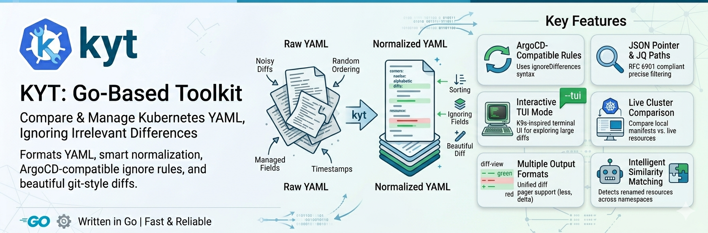

# kyt

<p align="center">
  
</p>

`kyt` stands for Kubernetes Yaml Toolkit (or Know Your Things). 

A powerful CLI tool for formatting and comparing Kubernetes manifests with intelligent ignore rules.

## Overview

`kyt` is a Go-based toolkit designed to solve a common problem in Kubernetes workflows: **comparing and managing YAML manifests while ignoring irrelevant differences**.

When working with tools like Helm, Kustomize, or ArgoCD, you often need to compare manifests to detect drift, validate changes, or ensure consistency. However, raw YAML diffs are noisy - filled with differences in field ordering, timestamps, managed fields, and other metadata that doesn't matter for your use case.

**kyt solves this by:**

1. **Formatting manifests** - Sorts keys alphabetically for consistent YAML structure
2. **Smart comparison** - Normalizes and compares manifests using ArgoCD-compatible ignore rules (removes fields, applies custom rules, sorts keys)
3. **Beautiful diffs** - Generates unified diff output (git-style) that's easy to read and integrate with tools ([delta](https://github.com/dandavison/delta), [difftohtml](https://github.com/rtfpessoa/diff2html) ...)
4. **Terminal UI** - Terminal UI inspired by [k9s](https://github.com/derailed/k9s) for exploring large diffs

**Key Features:**

- 🎯 **ArgoCD-Compatible Rules**: Uses the same ignore syntax as ArgoCD's `ignoreDifferences`
- 🔍 **JSON Pointer Support**: RFC 6901 compliant JSON Pointers for precise field targeting
- 🎨 **JQ Path Expressions**: Powerful filtering with wildcards and conditionals
- 📊 **Multiple Output Formats**: Unified diff with optional pager support (less, delta, bat)
- 🖥️ **Interactive TUI Mode**: k9s-inspired terminal UI for exploring large diffs (`--tui`)
- 🎯 **Smart Normalization**: Removes managed fields, applies ignore rules, sorts keys (used by `diff`)
- ☸️ **Live Cluster Comparison**: Compare local manifests against live Kubernetes resources
- 🔧 **Format**: Sort keys consistently with `kyt fmt`
- 🔀 **Pipe-friendly**: Works seamlessly with kubectl, kustomize, helm
- 🤖 **Intelligent Similarity Matching**: Automatically detects renamed resources across namespaces
- 🎚️ **Configurable Matching**: Adjust similarity thresholds and data field importance
- 🎛️ **Resource Filtering**: Include/exclude specific resource kinds (supports short names like `cm`, `svc`, `deploy`)
- ⚡ **Fast & Reliable**: Written in Go with comprehensive test coverage

## Use Cases

- **Compare local manifests vs live cluster**: Detect configuration drift between Git (desired state) and actual cluster state
- **Compare across namespaces**: Compare production vs staging environments directly in the cluster
- **Compare Helm vs Kustomize outputs**: Validate migrations by comparing rendered manifests while ignoring expected differences (field order, formatting, etc.)
- **Detect configuration drift**: Compare desired state (Git) with actual cluster state (`kubectl get`), ignoring dynamic fields like timestamps and resource versions
- **CI/CD validation**: Ensure manifest changes are intentional by comparing PR changes against production, with rules to ignore acceptable differences
- **Pre-deployment validation**: Compare what's currently deployed vs what will be deployed, filtering out noise
- **Format and standardize**: Clean up YAML files by sorting keys alphabetically for consistent formatting

## Quick Start

```bash
# Build from source
git clone https://github.com/nhuray/kyt.git
cd kyt
make build

# Compare two manifest files
./bin/kyt diff source.yaml target.yaml

# Compare directories
./bin/kyt diff ./kustomize-output ./helm-output

# Compare local manifests against live cluster
./bin/kyt diff ./manifests ns:production

# Compare two namespaces in the cluster
./bin/kyt diff ns:production ns:staging

# Interactive TUI mode for exploring diffs
./bin/kyt diff ./manifests ns:production --tui

# Normalize a manifest file
./bin/kyt fmt deployment.yaml

# Pipe manifests through kyt
kustomize build . | kyt fmt | kubectl apply -f -

# Use custom config
./bin/kyt diff -c .kyt.yaml source.yaml target.yaml

# Output JSON for CI/CD
./bin/kyt diff -o json source.yaml target.yaml
```

## Commands

### `kyt diff` - Compare manifests

Compare two Kubernetes manifest files, directories, or live cluster namespaces with smart ignore rules and intelligent similarity matching.

**Interactive TUI Mode:**

Launch an interactive k9s-inspired terminal UI for exploring diffs with `--tui`. Perfect for navigating large diffs with hundreds of resources.

```bash
# Launch TUI for interactive exploration
kyt diff source.yaml target.yaml --tui

# Compare namespaces in TUI
kyt diff ns:production ns:staging --tui

# All filtering options work with TUI
kyt diff --include deploy,svc ns:prod ns:staging --tui
```

**TUI Features:**
- **Tabbed Views**: All / Added / Modified / Removed resources
- **Navigation**: vim-style keybindings (h/j/k/l, g/G)
- **Search**: Filter by Kind, Name, or Namespace (`/`)
- **Sorting**: Sort by name (`N`) or status (`S`) with reverse toggle
- **Diff Modes**: Side-by-side and unified views (`s`, `u`)
- **Quit**: `:q` to quit, `q` to go back

**Live Cluster Comparison:**

Use the `ns:namespace` syntax to fetch and compare resources directly from Kubernetes clusters. kyt automatically uses your current kubectl context, or you can specify a different context with `--context`.

```bash
# Compare local manifests against live cluster (uses current context)
kyt diff ./manifests ns:production

# Compare two namespaces in the same cluster
kyt diff ns:production ns:staging

# Compare using a specific cluster context
kyt diff --context prod ns:production ns:staging

# Compare specific resource types from cluster
kyt diff --include deploy,svc,cm ns:production ns:staging

# Verbose output shows connection and resource fetching details
kyt diff -v ns:production ns:staging
```

**Similarity Matching:**

kyt can automatically detect renamed or relocated resources across namespaces using structural similarity. This is particularly useful when comparing production vs staging environments where resource names and namespaces may differ.

```bash
# Basic comparison
kyt diff source.yaml target.yaml

# Compare directories
kyt diff ./helm-output ./kustomize-output

# Compare across namespaces (prod vs staging)
kyt diff ./prod-manifests ./staging-manifests

# Disable similarity matching (exact name match only)
kyt diff --exact-match source.yaml target.yaml

# Adjust similarity threshold (0.0-1.0, default: 0.7)
kyt diff --similarity-threshold 0.8 source.yaml target.yaml

# Boost ConfigMap/Secret data field importance (1-10, default: 2)
# Higher values prioritize data content over metadata differences
kyt diff --data-similarity-boost 4 source.yaml target.yaml

# Compare only specific resource types
kyt diff --include cm,svc,deploy source.yaml target.yaml

# Exclude specific resource types
kyt diff --exclude secrets source.yaml target.yaml

# Show summary of changes
kyt diff --summary source.yaml target.yaml

# Control output colorization
kyt diff --color always source.yaml target.yaml   # Always colorize
kyt diff --color never source.yaml target.yaml    # Never colorize
kyt diff --color auto source.yaml target.yaml     # Auto (default)

# Write output to file
kyt diff -o diff.txt source.yaml target.yaml
```

**Exit Codes:**
- `0` - No differences found
- `1` - Differences detected
- `2` - Error (invalid YAML, missing files, etc.)

### `kyt fmt` - Format manifests

Format Kubernetes manifests by sorting keys alphabetically for consistent YAML structure.

```bash
# Format a file to stdout
kyt fmt deployment.yaml

# Format a directory to stdout
kyt fmt ./manifests

# Format and write back to source files
kyt fmt -w ./manifests

# Format from stdin
cat deployment.yaml | kyt fmt

# Chain with other tools
kustomize build . | kyt fmt | kubectl apply -f -
helm template . | kyt fmt > formatted.yaml
```

### `kyt version` - Version information

```bash
kyt version
```

## Configuration

The `diff` command uses `.kyt.yaml` for normalization rules, similarity matching options, and ignore rules. The tool searches for this file in the current directory and parent directories. 
The `fmt` command does not use configuration - it only sorts keys.

```yaml
# .kyt.yaml
diff:
  # Ignore differences for specific resources
  ignoreDifferences:
    # Ignore all labels and annotations
    - group: ""
      kind: "*"
      jsonPointers:
        - /metadata/labels
        - /metadata/annotations
  
    # Ignore Istio sidecar containers
    - group: "apps"
      kind: "Deployment"
      jqPathExpressions:
        - .spec.template.spec.containers[] | select(.name == "istio-proxy")
  
    # Ignore specific fields in Services
    - group: ""
      kind: "Service"
      jsonPointers:
        - /spec/clusterIP
        - /spec/clusterIPs

  # Diff options
  options:
    contextLines: 3              # Lines of context in unified diff (default: 3)
    similarityThreshold: 0.7     # Min similarity score for matching (0.0-1.0, default: 0.7)
    dataSimilarityBoost: 2       # Boost for ConfigMap/Secret data fields (1-10, default: 2)

  # Fuzzy string matching configuration
  fuzzyMatching:
    enabled: true                # Enable Levenshtein distance for strings (default: true)
    minStringLength: 100         # Min string length for fuzzy matching (default: 100)

  # Normalization options
  normalization:
    sortKeys: true               # Sort object keys alphabetically
    removeDefaultFields:         # Fields to remove before comparison
      - "/status"
      - "/metadata/managedFields"
      - "/metadata/creationTimestamp"

  # Optional: pipe output through external diff viewer
  pager: ""  # Examples: "delta --side-by-side", "bat --language=diff", "less -R"
```

See [examples/.kyt.yaml](examples/.kyt.yaml) for a complete configuration example.

## Installation

### Binary Releases (Recommended)

Download pre-built binaries from [GitHub Releases](https://github.com/nhuray/kyt/releases):

**Linux (x86_64):**
```bash
curl -L https://github.com/nhuray/kyt/releases/latest/download/kyt_Linux_x86_64.tar.gz | tar xz
sudo mv kyt /usr/local/bin/
```

**macOS (Apple Silicon):**
```bash
curl -L https://github.com/nhuray/kyt/releases/latest/download/kyt_Darwin_arm64.tar.gz | tar xz
sudo mv kyt /usr/local/bin/
```

**macOS (Intel):**
```bash
curl -L https://github.com/nhuray/kyt/releases/latest/download/kyt_Darwin_x86_64.tar.gz | tar xz
sudo mv kyt /usr/local/bin/
```

**Windows (PowerShell):**
```powershell
Invoke-WebRequest -Uri "https://github.com/nhuray/kyt/releases/latest/download/kyt_Windows_x86_64.zip" -OutFile "kyt.zip"
Expand-Archive -Path "kyt.zip" -DestinationPath .
# Add kyt.exe to your PATH
```

### Using Go Install

```bash
go install github.com/nhuray/kyt/cmd/kyt@latest
```

### From Source

```bash
git clone https://github.com/nhuray/kyt.git
cd kyt

# Using Make (recommended)
make build

# Or directly with Go
go build -o bin/kyt ./cmd/kyt

# Optional: Install to your PATH
make install
# Or manually: cp bin/kyt /usr/local/bin/
```

### Verify Installation

```bash
kyt version
```

## Documentation

- **[Cluster Comparison Guide](docs/cluster-comparison.md)** - Complete guide to comparing live Kubernetes resources
- **[fmt Command Guide](docs/fmt.md)** - Complete guide to formatting manifests with configuration options
- **[diff Command Guide](docs/diff.md)** - Advanced comparison techniques with JQ expressions and examples
- **[Example Configs](examples/)** - Sample configurations and manifests

## Testing

The project has comprehensive test coverage:

- **240+ tests total** covering all major functionality
- All tests passing
- Covers: config loading, manifest parsing, normalization, diffing, output formatting, CLI commands, cluster operations

Run tests:

```bash
# Run all tests
make test

# Run with verbose output
make test-verbose

# Run with coverage report
make test-coverage

# Or use go directly
go test ./...
go test -v ./...
go test -coverprofile=coverage.out ./...
```

## Development

```bash
# Show all available make targets
make help

# Build the binary
make build

# Run tests
make test

# Clean build artifacts
make clean

# Run with example manifests
make run
make run-json
```

## Dependencies

**Go Libraries:**

- [client-go](https://github.com/kubernetes/client-go) - Kubernetes client library for live cluster access
- [go-udiff](https://github.com/aymanbagabas/go-udiff) - Unified diff generation
- [ArgoCD](https://github.com/argoproj/argo-cd) - Ignore rules engine
- [gojq](https://github.com/itchyny/gojq) - JQ implementation in Go
- [cobra](https://github.com/spf13/cobra) - CLI framework
- [bubbletea](https://github.com/charmbracelet/bubbletea) - TUI framework (for `--tui` mode)
- [bubbles](https://github.com/charmbracelet/bubbles) - TUI components (table, viewport)
- [lipgloss](https://github.com/charmbracelet/lipgloss) - Terminal styling

## Inspiration

This project is inspired by:

- [ArgoCD's diff customization](https://argo-cd.readthedocs.io/en/stable/user-guide/diff-customization/)
- [k9s](https://github.com/derailed/k9s) - Kubernetes CLI with TUI (inspired the `--tui` mode)
- [kubectl diff](https://kubernetes.io/docs/reference/generated/kubectl/kubectl-commands#diff)
- [dyff](https://github.com/homeport/dyff) - YAML diff tool
- [helm-drift](https://github.com/nikhilsbhat/helm-drift) - Helm drift detection

## Contributing

Contributions are welcome! Please see [CONTRIBUTING.md](CONTRIBUTING.md) _(coming soon)_ for guidelines.

## License

MIT License - See [LICENSE](LICENSE) for details.

## Author

Created by Nicolas Huray ([@nhuray](https://github.com/nhuray))
